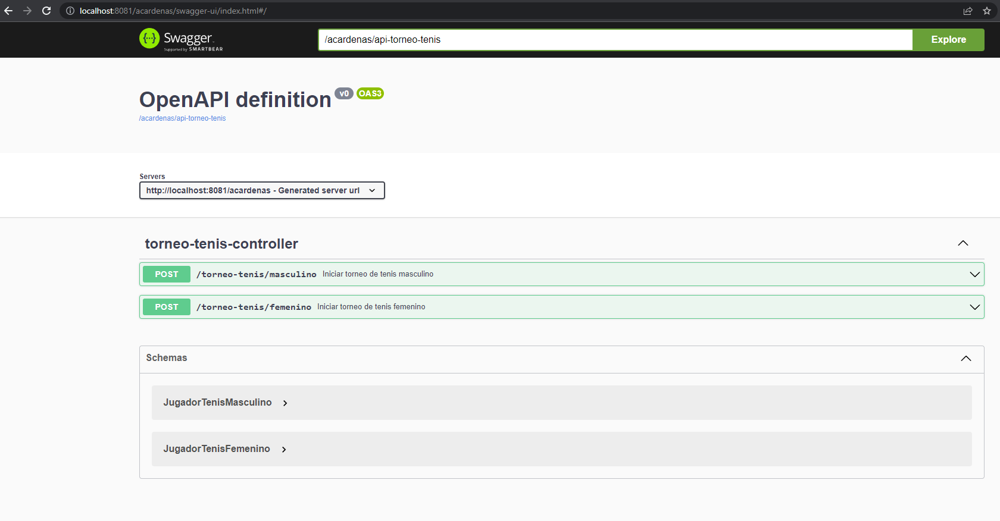

# torneo-tenis
Servicio que simula el torneo de tenis tanto femenino como masculino

## Compilación del proyecto

```bash
# Compilación completa con las pruebas unitarias
$ mvn clean install 
# Compilación sin las pruebas unitarias
$ mvn clean install -DSkipTests
```
## Uso
El servicio está configurado para ejecutar en el puerto `8081` com el path principal `acardenas`.

###### Ejemplo torneo femenino:
```bash
Método -> POST
Ruta   -> http://localhost:8081/acardenas/torneo-tenis/femenino
```
- Body
  ```bash
  [
    {
      "nombre":"Maria",
      "nivelHabilidad": 50,
      "tiempoReaccionSegundos":2
    },
    {
      "nombre":"Laura",
      "nivelHabilidad": 40,
      "tiempoReaccionSegundos":6
    },
    {
      "nombre":"Jessica",
      "nivelHabilidad": 40,
      "tiempoReaccionSegundos":6
    },
    {
      "nombre":"Dina",
      "nivelHabilidad": 40,
      "tiempoReaccionSegundos":6
    }
  ]
  ```
- Repuesta con el ganador
   ```bash
  Status: 200
  
  {
    "nombre": "Jessica",
    "nivelHabilidad": 40,
    "tiempoReaccionSegundos": 6
  }
  ```
    ```bash
    Status: 400

    {
        "path": "/acardenas/torneo-tenis/femenino",
        "status": 400,
        "data": null,
        "apiError": {
            "typeClass": "acardenas.com.exception.ValidationException",
            "message": "Error, número de jugadores no es potencia de 2",
            "errorTrack": {
                "classLoaderName": "app",
                "moduleName": null,
                "moduleVersion": null,
                "methodName": "iniciarTorneo",
                "fileName": "TorneoTenis.java",
                "lineNumber": 25,
                "className": "acardenas.com.services.TorneoTenis",
                "nativeMethod": false
            }
        }
    }
  ```
###### Ejemplo Swagger:
`http://localhost:8081/acardenas/swagger-ui/index.html#/`

